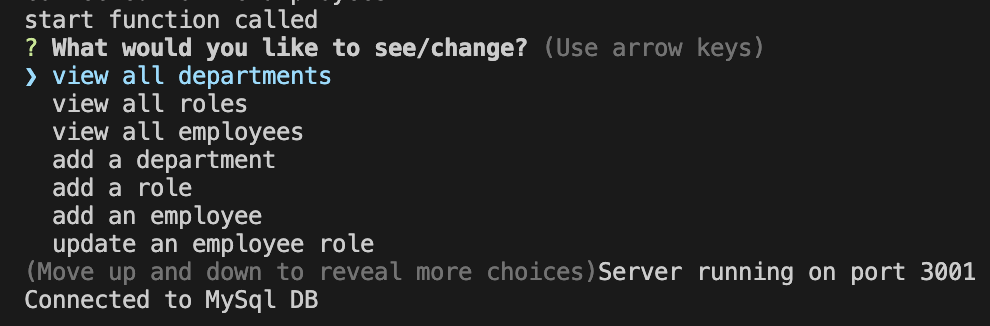
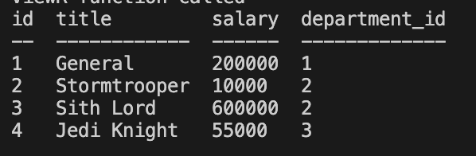

# es-que-el

## Description

this program will run in your terminal and allow you to keep track of your employees. veiw them, add some, and delete.

## Installation

- `npm i`
- in terminal run `npn run start`
    
## Usage/Examples

- once you install packages `npm i`
- you can can run `npm run start` in the terminal
- you can scroll though the interface and choose a selection
- for example, if you choose 'veiw all departmants, it will show you a table of all the departments in you terminal.

## Screenshots

shows the db connected, and choices to choose from

shows the roles table after it has been selected

## License

[MIT](https://choosealicense.com/licenses/mit/)

